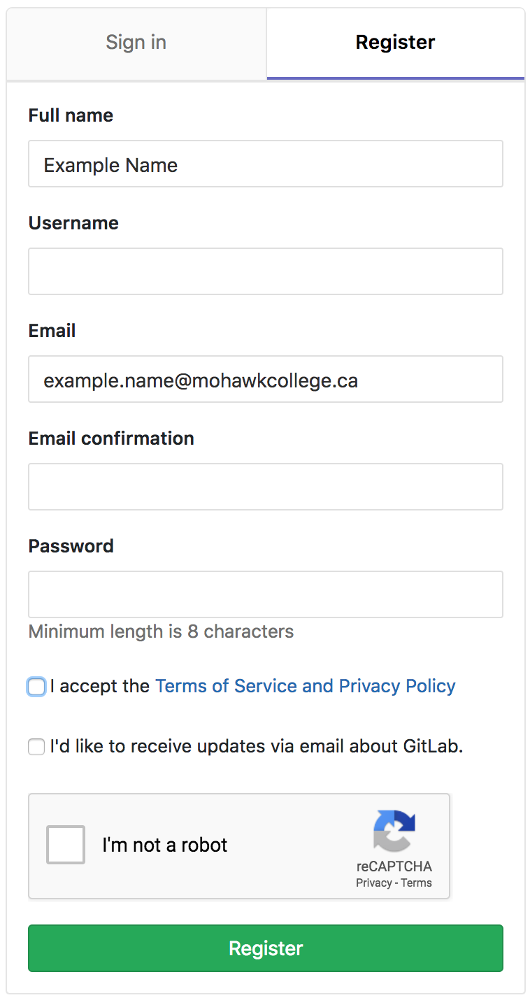
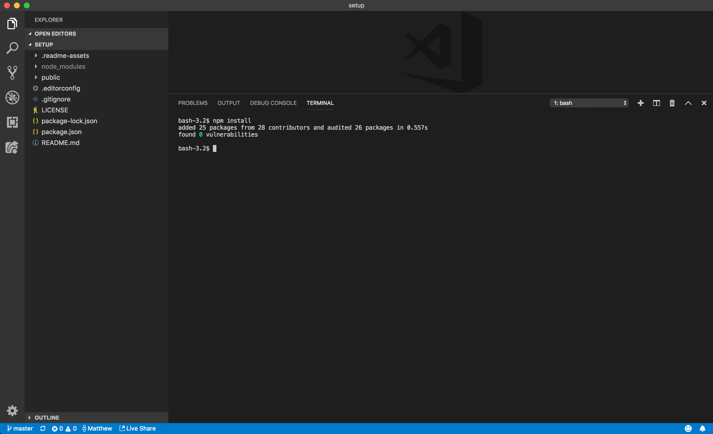

# Setup Instructions

This repository will explain how to work with all of the labs and assignments involving development for the _Responsive Design Frameworks_ course. All repositories will have their own standalone web server and other tooling on top of NodeJS and npm.

The tools and methods used to work through these labs and assignments are exactly what you would find in the world of modern professional web development. This exposure to them will give you useful experience as well as provide you with a superior development workflow.

***
- [Software Installation](#software-installation)
- [Making a GitLab Account](#making-a-Gitlab-account)
- [Invitation to Course Group](#invitation-to-course-group)
- [Forking a Repository](#forking-a-repository)
- [Running a Repository](#running-a-repository)
	- [Setup](#setup)
	- [Continuing where you Left Off](#continuing-where-you-left-off)
	- [Breakdown](#breakdown)
- [Submission](#submissions)
- [Resources](#resources)
***

## Software Installation

Below is a list of required software. You can download each item by clicking on the links below. All software will work on Windows, Mac, and Linux operating systems.

- [**Visual Studio Code:**](https://code.visualstudio.com/) The code editor we will primarily be supporting through this course. After it's installed [install](https://code.visualstudio.com/docs/editor/extension-gallery) the following extensions by name:
	- **VS Live Share:** Allows you to create a sharable link so the teacher as well as others can provide assistance as if they were remote controlling your computer.
	- **EditorConfig for VS Code:** Ensures consistent formatting of your files automatically.
- [**Node.js:**](https://nodejs.org/en/) Runtime environment for JavaScript all development tooling will run on, including our development web server. **Download the latest _LTS_ version**.
- [**Git:**](https://git-scm.com/downloads) Allows us to download code and collaborate among teammates working on the same project.
	- [**Fork _(optional)_:**](https://Git-fork.com) A graphical interface to complement Git, which is a command line application. No instructions will be provided by this but you may find it easier to use.

## Making a GitLab Account

[GitLab](https://Gitlab.com/) is the service we'll be using to host our Git repositories. Later in this program we're going to focus on Git in a later course, but if you're interested in understanding it better [this article](https://Git-scm.com/book/en/v2/Getting-Started-Git-Basics) may be of help. All the code and website assets we'll be using for this course will be hosted on GitLab.

1. Visit the [GitLab home page](https://gitlab.com/) and click on the _Reigster_ button on the top right of the screen.

1. Fill out the registration form with your College email address.

1. You should see a page asking you to go to check your  email. Open it and click on the confirmation link. After confirming make sure you're logged in as that user.

## Invitation to Course Group

You should get an email from GitLab triggered through your instructor stating you've joined a group. When this is done we can see all the repositories we'll be working with through this course. If you have any difficulties with this step contact your instructor to ensure an email was sent or offer any help.

The GitLab group page for this course should look like this:

## Forking a Repository

Git allows us to create checkpoints known as _commits_ while we code. We  also want to store a backup of our code on GitLab to ensure none of our work gets lots. An additional side-effect of this is we'll be able to submit our work with a fantastic [line-by-line review process](https://docs.gitlab.com/ee/user/discussions/) as we progress in this course. For these reasons we want to _Fork_ any repository we'll be working off of, **especially** if we wish to submit it later.

**We can fork any repository in our course's group by clicking on this button:**

You should now have a copy of the forked repository available under your personal username. For official instructions you can read the [How to fork a project](https://docs.gitlab.com/ee/gitlab-basics/fork-project.html) GitLab documentation.

## Running a Repository

### Setup

Any work that involves writing code in this course will involve following these same steps to download the required files to begin. Most of these steps only need to be completed the first time you begin working on something from a GitLab repository.

1. In _Visual Studio Code_ open the folder you want your work for this course to exist within:
	- **Mac:** `File -> Open`
	
	- **Windows:** `File -> Open Folder`

1. With Visual Studio Code open the built-in command line terminal:
	- **Windows:** ``Ctrl + ` ``
	- **Mac:** ``Cmd + ` ``
	

1. Enter `git clone [HTTPS URL]` and hit the ***Enter*** key to download the project.

1. Repeat step one of these instructions but open the folder already cloned.

1. With Visual Studio Code open the built-in command line terminal.

1. Run the following commands by typing them in then hitting the ***Enter*** key:
	1. `npm install`
	
	1. `npm start`
	

1. Open your web browser and navigate to the URLs displayed in your command line interface (probably [http://localhost:8080/](http://localhost:8080)).

#### Result

### Continuing where you Left Off

The steps that need to be completed when returning back to your work to pick up where you left off are:

1. In _Visual Studio Code_ open the folder you want your work for this course to exist within:
	- **Mac:** `File -> Open`
	- **Windows:** `File -> Open Folder`

1. With Visual Studio Code open the built-in command line terminal:
	- **Windows:** ``Ctrl + ` ``
	- **Mac:** ``Cmd + ` ``

1. Run `npm start` in the terminal.

1. Open your web browser and navigate to the URLs displayed in your command line interface (probably [http://localhost:8080/](http://localhost:8080)).

### Breakdown

You may be a little confused about what's going on when we run these commands.

#### `git clone`
Copies the repository from GitLab onto our local computer.

#### `npm install`
Installs all of the project's dependencies listed within the [`package.json`](https://gitlab.com/mohawk-responsive-design-frameworks/setup/blob/master/package.json#L20) file. This may include a responsive design framework itself, but all of them will come with [`http-server`](https://www.npmjs.com/package/http-server) that allows us to easily spin up a development web server instead of needing to install something like Apache.

#### `npm start`
Runs the npm _start_ script found in the [`package.json`](https://gitlab.com/mohawk-responsive-design-frameworks/setup/blob/master/package.json#L7) file. It spins up the web server using the `public` folder as the document root of the website.

### Files

If we look on the file pane of Visual Studio Code we can see the files that come with the repository.

| Name | Modify | Description |
| --- | --- | --- |
| `.readme-assets` | **No** | Contains images or other assets required in order for this document you're reading right now to work. |
| `node_modules` | **No** | Contains dependencies installed through the `npm install` command. Never ever directly modify this folder. |
| `public` | **Yes** | Document root for our web server. Contains all the files served by the website. |
| `.editorconfig` | **Not Recommended** | Works with the [EditorConfig for VS Code](https://marketplace.visualstudio.com/items?itemName=EditorConfig.EditorConfig) Visual Studio Code extension to ensure some degree of consistent formatting throughout your project. If you're confidant in what you're doing, feel free to modify it to your liking per-project but this is not recommended. |
| `.gitignore` | **No** | Ensures certain files and directories such as `node_modules` don't get committed to the git repository. |
| `LICENSE` | **No** | Contains licensing information for this repository. |
| `package-lock.json` | **No** | Allows for faster execution of the `npm install` command. Always ignore this file, and if git complains about it, delete it then run `npm install` again. |
| `package.json` | **No** | Contains meta-information about the project for npm. When we install dependencies for example this file is ***automatically*** modified for us. We will never need to manually. |
| `README.md` | **No** | Contains the [markdown](https://en.wikipedia.org/wiki/Markdown) that generates the very document you're reading now. |

## Submission

To submit our work, we need to visit the GitLab page for our forked repository. Ensure that the copy on GitLab's repository page is up to date. If it's not, run the following commands in Visual Studio Code's terminal. If you have any problems, ask your instructor for help.

1. `git add -A`
1. `git commit -m "description of changes"`
1. `git push`

When this is complete, check out the official documentation [How to create a merge request](https://docs.gitlab.com/ee/gitlab-basics/add-merge-request.html) on GitLab. Expect a code review to be conducted by the instructor of this class. The more code of yours that can be submitted and reviewed, the more valuable feedback you can use to further your abilities.

## Resources

- [**Visual Studio Code:** Extension Marketplace](https://code.visualstudio.com/docs/editor/extension-gallery) (installing extensions)
- [**Git:** Basics](https://Git-scm.com/book/en/v2/Getting-Started-Git-Basics)
- **[GitLab](https://gitlab.com/)**
	- [How to fork a project](https://docs.gitlab.com/ee/gitlab-basics/fork-project.html)
	- [Instantiate workflow with clone](https://docs.gitlab.com/ee/university/training/topics/getting_started.html#instantiate-workflow-with-clone)
	- [How to create a merge request](https://docs.gitlab.com/ee/gitlab-basics/add-merge-request.html)
	- [Merge requests](https://docs.gitlab.com/ee/user/project/merge_requests/)
	- [Discussions](https://docs.gitlab.com/ee/user/discussions/)
